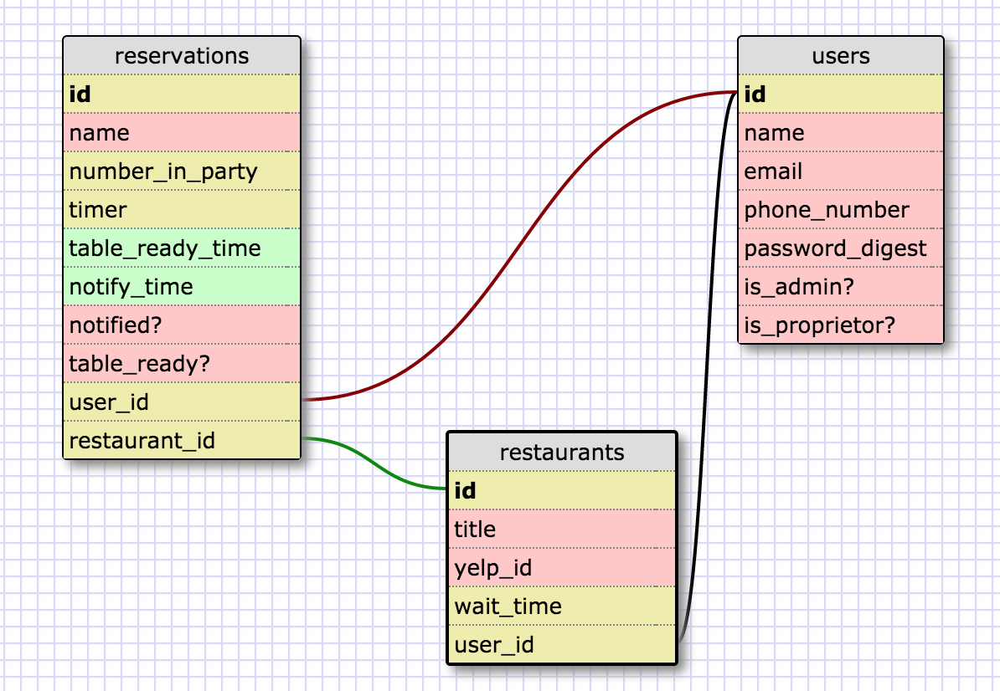

# WaitLess

Waitless is a web application built to help customers look up the wait time for their favorite restaurants, sign onto the waitlists remotely, and be notified when they should leave. 

This app is available at [http://wait-less.herokuapp.com/](http://wait-less.herokuapp.com/).

## Database Schema

## User Stories

- As a user, I want to be able to see restaurants in my vicinity.
- As a user, I want to be able to see the wait time for each of those restaurants.
- As a user, I want to be able to view the waitlist for a restaurant.
- As a user, I want to be able to add myself to the waitlist for a restaurant.
- As a user, I want to be notified when it is my turn to be seated.
- As a user, I want to log in and see my current waitlist reservation.
- As a user, I want to be able to change the number of people in my party.

- As an admin, I want to see the current waitlist for my restaurant.
- As an admin, I want to be able to change the number of people in a party.
- As an admin, I want to be able to remove a party from the waitlist when they have been seated.

